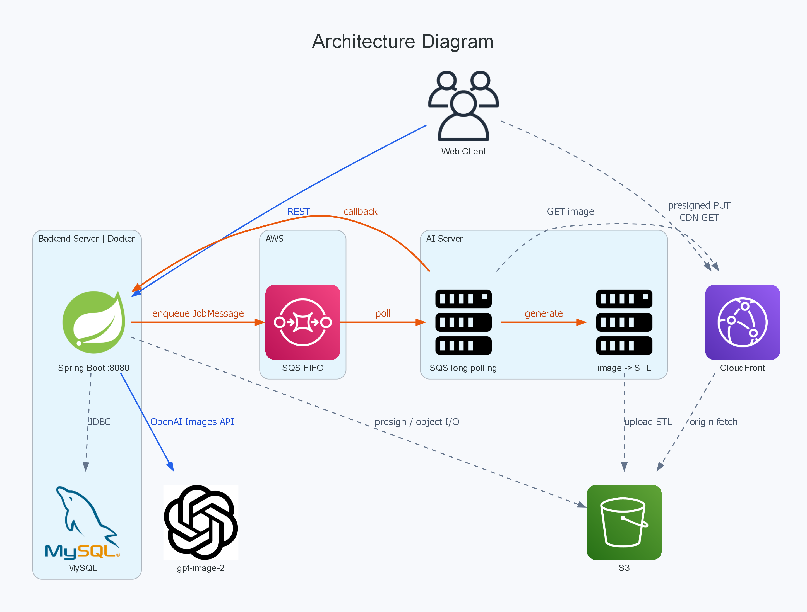

# meotsa-hackathon-be

사진 한 장을 AI로 3D 피규어 스타일로 바꾸고, 3D 모델(STL)까지 생성해 프린트샵 견적을 받아보는 서비스의 백엔드.

## 서비스 소개

3D 프린팅으로 굿즈를 만들려면 모델링 지식이 필요하고, 만들고 나서도 업체마다 다른 단가를 일일이 비교해야 한다. 진입 장벽이 높아 "내 사진으로 피규어 하나 뽑아보고 싶다" 정도의 가벼운 욕구는 대부분 시도조차 되지 않는다.

이 서비스는 **사진 업로드 하나로 `이미지 스타일 변환 → 3D 모델 생성 → 출력 가능 여부 검증 → 프린트샵 견적 비교`까지 한 번에** 이어지도록 만든다.

## 핵심 플로우

1. **사진 업로드** — presigned URL로 클라이언트가 S3에 직접 업로드
2. **AI 스타일 변환** — `gpt-image-2`로 모델링용 이미지 생성
3. **3D 모델 생성** — SQS로 작업을 넘기고 AI 서버가 STL 생성 후 콜백
4. **프린트샵 견적 비교** — 모델 부피·수량·재료 기준으로 업체별 단가 계산

## 아키텍처



### 구성 요소

| 구성 요소 | 역할 |
|-----------|------|
| **Spring Boot :8080 (Docker)** | REST API, JWT 인증, 견적 계산 |
| **MySQL** | Creation / Job / User / PrintShop 영속화 |
| **S3 + CloudFront** | 원본·스타일 이미지, STL 저장. 업로드는 presigned PUT, 조회는 CDN |
| **OpenAI Images API (`gpt-image-2`)** | 이미지 스타일 변환 (동기 호출) |
| **SQS FIFO** | 백엔드와 AI 서버 사이의 비동기 잡 큐 (`messageGroupId="job"`, jobId로 중복 제거) |
| **AI 서버** | 큐 long polling → image→STL 변환 → S3 업로드 → 백엔드 콜백 |

### 설계 포인트

- **3D 생성은 SQS FIFO로 넘긴다.** AI 서버가 RTX 4060(VRAM 8GB) 1대라 모델을 하나만 올릴 수 있어, 한 번에 한 건(평균 1~3분)씩만 처리된다. 큐에 넣고 즉시 응답한 뒤 콜백으로 받아, 요청 스레드가 수 분씩 묶이지 않는다. 메시지 그룹을 하나로 묶어 순차 처리를 보장하고, 중복 적재는 jobId로 막는다.
- **파일 I/O는 서버를 우회시킨다.** 업로드는 presigned URL, 조회는 CloudFront로 처리해 이미지·STL 트래픽이 애플리케이션 서버를 거치지 않는다.

### 패키지 구조

`com.meotsa` 하위를 도메인별로 나누고, 공통은 `global`에 둔다. 모든 도메인은 아래 `creation`과 동일한 레이어 구성을 따른다.

```
com.meotsa/
├── global/       # client, config, docs, exception, jwt, security
├── auth/         # 회원가입, 로그인, 토큰 재발급
├── user/
├── printshop/    # 업체 정보, 견적 계산
├── creation/     # 파일 업로드, 스타일 변환, 3D 모델 잡
│   ├── controller/
│   ├── docs/         # Swagger 스펙 인터페이스
│   ├── service/
│   ├── repository/
│   ├── entity/
│   ├── dto/          # request/, response/, message/
│   └── exception/    # 도메인 ErrorCode
└── MeotsaHackathonApplication.kt
```

## 기술 스택

| 구분 | 내용                                                           |
|------|--------------------------------------------------------------|
| Language / Runtime | Kotlin 2.2.0, Java 21 (LTS)                                  |
| Framework | Spring Boot 3.5.16 (Web, Security, Data JPA, Validation)     |
| DB | MySQL                                                        |
| 인프라 | 자체 서버(Ubuntu), AWS S3 · SQS (AWS SDK v2 2.28.16), CloudFront |
| 배포 | Docker, GitHub Actions → GHCR → SSH 배포                       |
