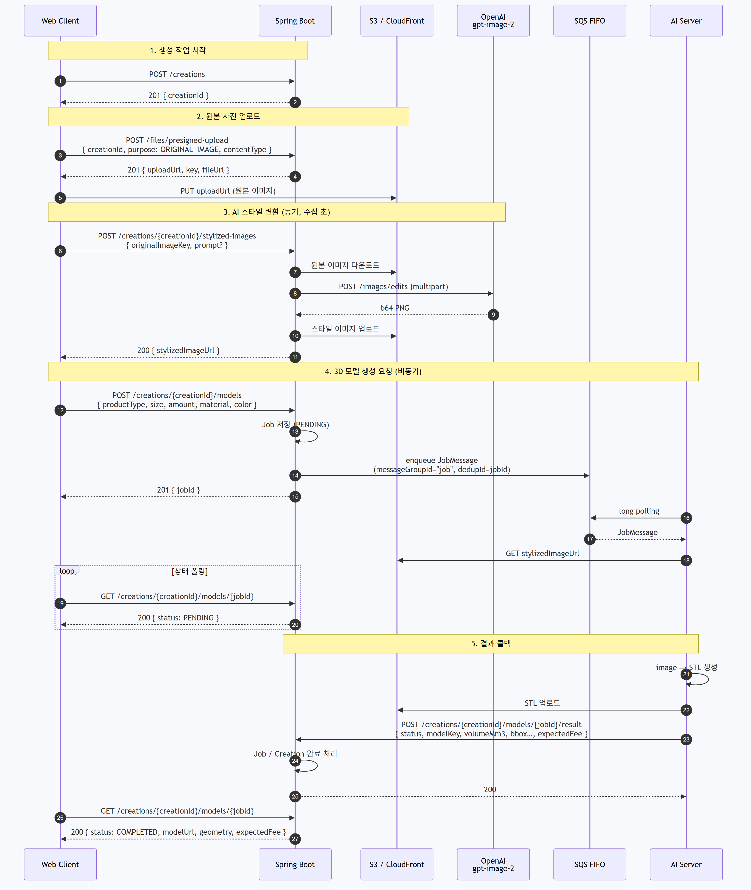

# API 흐름

사진 업로드부터 3D 모델(STL)이 나오기까지의 API 호출 순서.

## 시퀀스



다이어그램 소스는 [`api-flow.mmd`](api-flow.mmd)이고, 아래 명령으로 PNG를 다시 만든다.

```bash
npx -y @mermaid-js/mermaid-cli -i docs/api-flow.mmd -o docs/api-flow.png -b "#f7f9fc" -w 1800 -s 2
```

## 엔드포인트

| 순서 | 엔드포인트 | 응답 | 성격 |
|------|-----------|------|------|
| 1 | `POST /creations` | 201 `CreationStartResponse` | 동기 |
| 2 | `POST /files/presigned-upload` | 201 `PresignedUploadResponse` | 동기 |
| 3 | `POST /creations/{creationId}/stylized-images` | 200 `StylizedImageResponse` | 동기 (외부 AI 대기) |
| 3' | `POST /creations/{creationId}/stylized-images/retry` | 200 `StylizedImageResponse` | 동기, 프롬프트만 바꿔 재변환 |
| 4 | `POST /creations/{creationId}/models` | 201 `JobCreateResponse` | 즉시 응답 + 큐 적재 |
| 5 | `GET /creations/{creationId}/models/{jobId}` | 200 `JobStatusResponse` | 폴링 |
| 6 | `POST /creations/{creationId}/models/{jobId}/result` | 200 | AI 서버 → 백엔드 콜백 |

## 상태 전이

`Job.status`는 `PENDING → COMPLETED | FAILED` 단방향이고, 이미 종료된 잡에 결과가 다시 들어오면 `JOB_ALREADY_FINISHED`로 거부한다.

```
POST /models        →  PENDING
  └ 콜백 COMPLETED  →  COMPLETED   (modelKey, geometry, structureCheck, widthCheck, expectedFee)
  └ 콜백 FAILED     →  FAILED      (error)
```

## 설계 포인트

- **이미지 변환은 트랜잭션 밖에서 한다.** OpenAI 호출이 수십 초 걸려 `ImageService`에 `@Transactional(propagation = NOT_SUPPORTED)`를 걸고, 변환이 끝난 뒤에만 DB에 쓴다. DB 커넥션을 외부 API 대기 시간 동안 붙잡지 않는다.
- **3D 생성만 비동기다.** AI 서버가 GPU 1대라 동시 처리가 불가능해서, SQS FIFO에 넣고 즉시 `jobId`를 반환한 뒤 콜백으로 결과를 받는다. `messageGroupId`를 하나로 묶어 순차 처리를, `jobId` 중복 제거로 이중 적재를 막는다.
- **파일 트래픽은 서버를 우회한다.** 업로드는 presigned PUT, 조회는 CloudFront. 원본 이미지 다운로드처럼 서버가 직접 바이트를 다뤄야 하는 경우에만 S3 SDK를 쓴다.
- **선행 조건은 상태로 검증한다.** `POST /models`는 `creation.stylizedImageKey`가 없으면 `STYLIZE_NOT_DONE`(409)으로 막아, 변환 없이 모델 생성이 큐에 들어가지 않게 한다.
